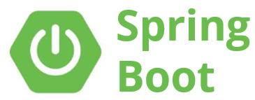

<!-- PROJECT LOGO -->
 

    

  <h3 align="center">조민우의 Spring boot</h3>

  

    더욱 수월한 웹 개발을 위한 Spring boot!

  

## 🚧 개발 환경

Windows 10, Spring Tool suite4, JavaSE-1.6(zulu15)

<!-- CONTRIBUTING -->
## 📄 파일 구성

- 

1. Fork the Project
2. Create your Feature Branch (`git checkout -b feature/AmazingFeature`)
3. Commit your Changes (`git commit -m 'Add some AmazingFeature'`)
4. Push to the Branch (`git push origin feature/AmazingFeature`)
5. Open a Pull Request

<!-- LICENSE -->
## 📝 License
Describe your License for your project. 

Distributed under the MIT License. See `LICENSE` for more information.

<!-- CONTACT -->
## 📫 Contact

Your Name - [@your_twitter](https://twitter.com/your_username) - email@example.com

Project Link: [https://github.com/your_username/repo_name](https://github.com/your_username/repo_name)

<!-- ACKNOWLEDGEMENTS -->
## Acknowledgements
* [Img Shields](https://shields.io)
* [GitHub Pages](https://pages.github.com)
* [Font Awesome](https://fontawesome.com)
* blah blah blah....

<!-- MARKDOWN LINKS & IMAGES -->
<!-- https://www.markdownguide.org/basic-syntax/#reference-style-links -->
[forks-shield]: https://img.shields.io/github/forks/roshanlam/ReadMeTemplate?style=for-the-badge
[forks-url]: https://github.com/roshanlam/ReadMeTemplate/network/members
[stars-shield]: https://img.shields.io/github/stars/roshanlam/ReadMeTemplate?style=for-the-badge
[stars-url]: https://github.com/roshanlam/ReadMeTemplate/stargazers
[issues-shield]: https://img.shields.io/github/issues/roshanlam/ReadMeTemplate?style=for-the-badge
[issues-url]: https://github.com/roshanlam/ReadMeTemplate/issues
[linkedin-shield]: https://img.shields.io/badge/-LinkedIn-black.svg?style=flat-square&logo=linkedin&colorB=555
[linkedin-url]: https://linkedin.com/in/roshan-lamichhane
